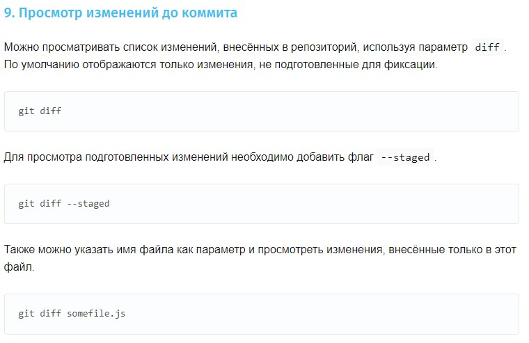

# ** Инструкция по работе GIT**

##Инициализация репозитория

Чтобы создать новый репозиторий в выбранной папке нужно ввести команду:

    git init

## Просмотр текущего состояни репозитория

Просматривать изменения, внесённые в репозиторий, можно с помощью параметра log. Он отображает список последних коммитов в порядке выполнения. Кроме того, добавив флаг -p, вы можете подробно изучить изменения, внесённые в каждый файл.

    git log

## Добавление версионности файлу

Просмотреть полный список изменений, внесённых конкретным коммитом, можно с помощью параметра show, указав идентификатор или хеш коммита.

    git show

## Фиксация измениений в репозитории

При создании коммита в репозитории можно добавить однострочное сообщение с помощью параметра commit с флагом -m. Само сообщение вводится непосредственно после флага, в кавычках.

    git commit -m "Short summary about the commit"

## Просмотр изменения в истории

Можно просматривать список изменений, внесённых в репозиторий, используя параметр diff.

    git diff

## Переключение между сохранениями

Восстановить файлы рабочего дерева, не подготовленные к коммиту, можно параметром checkout.

    git checkout

### Переключение на последнюю актуальную версию

git checkout --master произведет возвращение файла с названием
master к версии из последнего коммита.

    git checkout --master 

## Просмотр разници между коммитами

Можно просматривать список изменений, внесённых в репозиторий, используя параметр diff. По умолчанию отображаются только изменения, не подготовленные для фиксации.

    git diff

Для просмотра подготовленных изменений необходимо добавить флаг **--staged.**

    git diff --staged

Также можно указать имя файла как параметр и просмотреть изменения, внесённые только в этот файл.

    git diff somefile.js

# Ветки в GIT

## Создание веток

Создать новую ветку можно с помощью параметра branch, указав имя ветки.

    git branch new_branch_name

## Переключение между ветками

для перехода в другую ветку необходимо написать

    git checkout имя ветки

## Просмотр существующих веток

Можно просматривать полный список веток, используя параметр branch. Команда отобразит все ветки, отметит текущую звёздочкой (*) и выделит её цветом.

    git branch